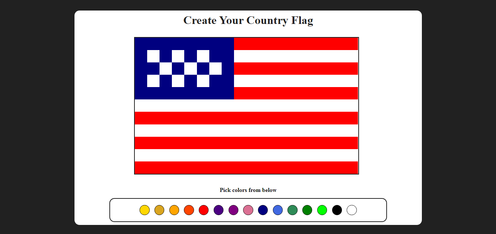

# Draw Your Flag Project
This project is a simple drawing of your country's flag. You can select the colors from the color palette and paste them into the box. 

## Built with
- HTML5
- CSS3
- Javascript

## [Check out the project here only desktop](https://almightynv.github.io/DrawYourFlag/)

I have started learning frontend development and I think you learn more by doing the practical work.
This project is purely created by only using HTML, CSS, and Javascript.
I have added the screenshots of the Drawing flag project. You can check the game by cloning this repository.

## Desktop view

If you want you can create more of these flags

## Mobile view
There is no mobile view to this only desktop.

## Made By
[NISHANT VILKAR](https://github.com/almightynv)
- [Linkedin](https://www.linkedin.com/in/nishantvilkar076/)
